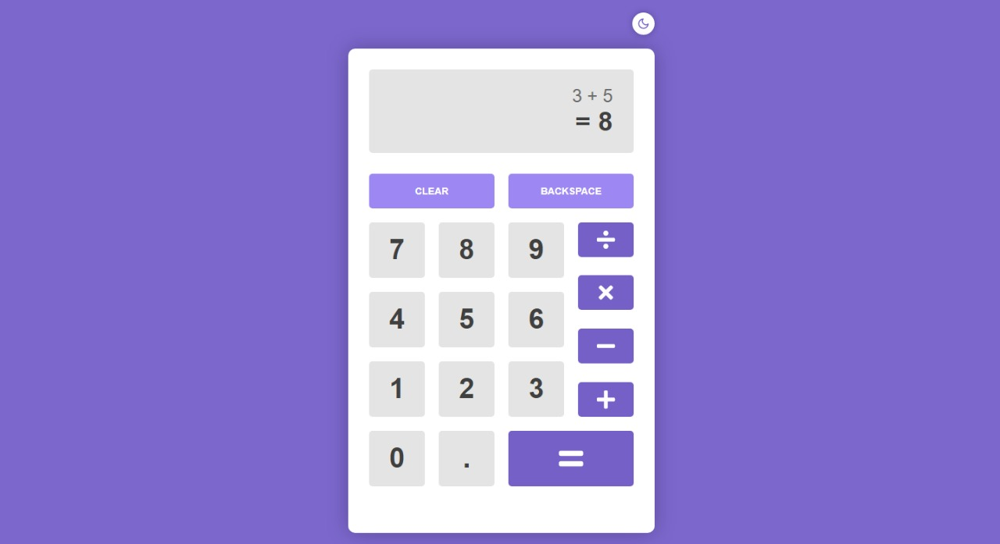
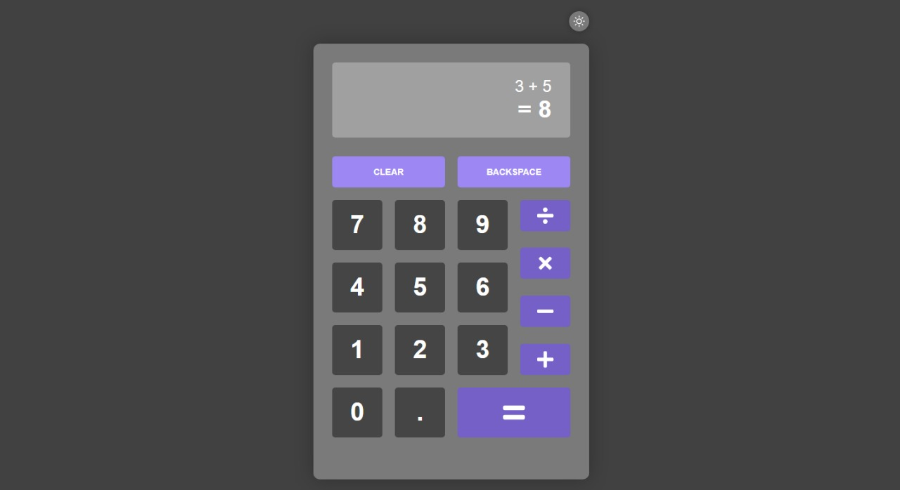

<h1 align="center"> 
   :memo: &nbsp; Projetos em React &nbsp; :memo:
</h1>

 
   <a href="#key-finalidade"> :key: Finalidade </a> &nbsp; | &nbsp;
   <a href="#open_file_folder-projetos"> :open_file_folder: Projetos </a> &nbsp; | &nbsp;
   <a href="#eye-preview"> :eye: Preview </a>

 
 
 

## :key: Finalidade
- Estudo
- Aplicação de conhecimento
- Prática

 

## :open_file_folder: Projetos
- [Calculadora](./calculator)
- [Todo list](./todolist)
- <h6>Mais projetos em breve...</h6>

 

## :eye: Preview
   
 

<h5> Calculadora </h5>

|   Light   |   Dark   |
|:---------:|:--------:|
|  |   | 

 
 

<h6 align="center">  Em processo de desenvolvimento por Julianne Volotão </h6>

 
 
